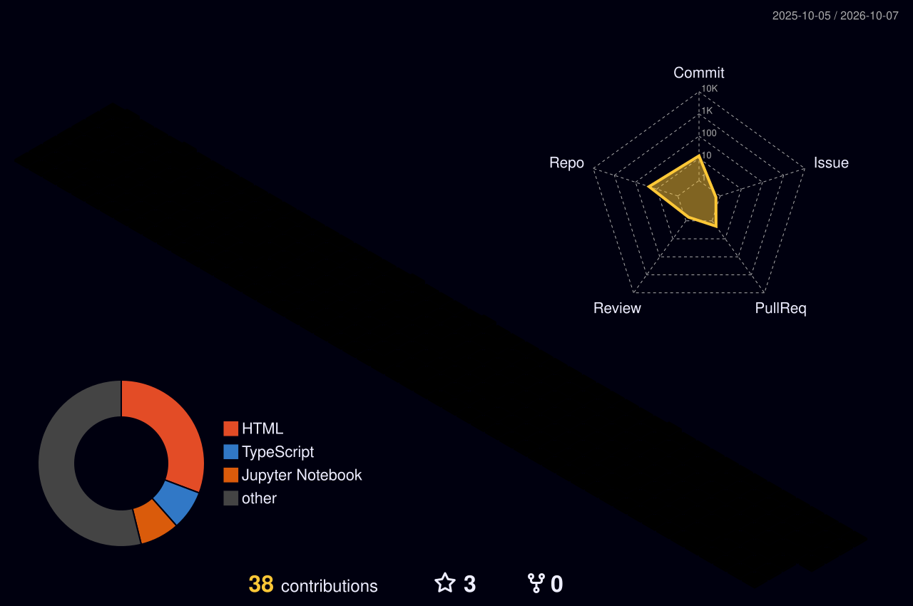

# Hi there, I'm Serene Plummer! 

  
  
  

## About Me

Hello! I'm **Serene Plummer**, a **Software Engineer** building **AI-powered tools**: agents, RAG pipelines, and the cloud infrastructure that ships them. I'm pursuing my Bachelor's in Computer Science at the [University of North Texas](https://www.unt.edu/), and I'm growing toward **AI engineering** roles.

🤖 **AI Agent Builder** whose RAG + MCP agents at Fidelity contributed to a **60% reduction in deployment cycles**  
☁️ **Cloud Engineer** automating AWS infrastructure with **Terraform** and **GitHub Actions**  
🎓 **4.0 GPA** in Computer Science, and a **STEM & Coding Instructor** teaching AI and programming

- 🔭 I'm currently building **Forma**, an AI resume optimizer
- 🌱 I'm exploring **multi-agent systems**, **LLM evals**, and **MCP servers**
- 👯 I'm looking to collaborate on AI engineering and developer-tooling projects
- 💬 Ask me about AI agents, RAG, MCP, Python, Java, TypeScript, AWS, and Terraform

## 💼 Professional Experience

### AWS Cloud Engineer | IDX Exchange
**September 2026 – Present | Boise, ID**
- ☁️ **Automated infrastructure and deployments** with **Terraform** and **GitHub Actions**
- 🔐 **Implemented keyless AWS authentication**, secrets management, and monitoring for repeatable, secure deployments
- 🛡️ **Strengthened cloud reliability** through cost optimization, data governance, and **disaster-recovery** strategies

### Software Engineer Intern | Fidelity Investments
**June 2026 – August 2026 | Westlake, TX**
- 🤖 **Engineered AI-powered agents** using **RAG**, **MCP** integrations, and prompt engineering to automate code quality and testing workflows
- ⚡ **Contributed to a 60% reduction in deployment cycles** by applying AI engineering practices to development workflows
- ✅ **Developed Java / Spring Boot test automation** integrated with Oracle and MySQL, catching defects earlier
- 🔄 **Collaborated in an Agile environment** using Git, Jira, and CI/CD to improve release reliability

### Data Analytics Intern | Common Point
**January 2026 – May 2026 | New York, NY**
- 📊 **Architected automated data analysis workflows** using AI-driven tools and **Google Cloud Platform**
- 🧹 **Engineered high-fidelity datasets** for large-scale research and predictive analysis, communicating insights with **Tableau**

### STEM & Coding Instructor | iCode School
**August 2025 – Present | McKinney, TX**
- 🧠 **Designed and delivered lessons** in AI concepts, prompt engineering, robotics, digital logic, and beginner programming
- 📈 **Drove a 35% improvement in students' problem-solving skills** through individualized mentorship

## 🚀 Tech Stack & Skills

### 💻 Programming Languages

### 🤖 AI/ML & Data Science

### ⚙️ Backend & Frontend

### 🗄️ Databases & Cloud

### 🚀 DevOps & Deployment

### 📊 Data & Analytics

### 🛠️ Development Tools

## 🎯 Areas of Expertise

<table>
  <tr>
    <td align="center" width="200">
       
      <strong>AI Engineering</strong> 
      <em>Agents, RAG & ML models</em>
    </td>
    <td align="center" width="200">
       
      <strong>Cloud & DevOps</strong> 
      <em>Infrastructure as code & CI/CD</em>
    </td>
    <td align="center" width="200">
       
      <strong>Software Engineering</strong> 
      <em>Backend services & test automation</em>
    </td>
  </tr>
</table>

## 🚀 Featured Projects

### 📝 Forma - AI Resume Optimizer *(In Development)* · [Repo](https://github.com/BonySage/Resume-Assistant)
**Tech Stack:** React, TypeScript, AI integration, Prompt Engineering  
- 🎯 **Analyzes resumes against job descriptions** to identify ATS compatibility gaps and missing keywords
- ✨ **Generates AI-driven recommendations**, compatibility scores, and tailored bullet points
- 💸 **Built as a cost-conscious alternative** to ATS tools charging about **$14/week ($728/year)**

### 🏥 HealthCert - Medical Appointment Booking · [Repo](https://github.com/serene4444/Medical-Appointment-Booking) · [Live Demo](https://serene4444.github.io/Medical-Appointment-Booking/)
**Tech Stack:** JavaScript, HTML5, CSS3, Node.js, Express.js  
- 📅 **Centralized appointment booking** and patient management in a secure, user-friendly web app
- ✅ **Validation logic** for consistent, accurate medication and patient data entry

### 🚀 SpaceX Launch Analysis - IBM Data Science Capstone · [Repo](https://github.com/serene4444/Data-Science-Capstone)
**Tech Stack:** Python, Pandas, scikit-learn, Folium, Plotly Dash  
- 🛰️ **Predicted Falcon 9 first-stage landing success** using data collection, wrangling, and ML classification
- 📊 **Built interactive Folium maps and a Plotly Dash dashboard** to explore launch sites and payload outcomes

## 🌟 Certifications & Badges

  
  
  

## 3D Contribution Calendar

  

## GitHub Stats

  
  
  

## Connect with Me

  <!-- Portfolio -->
  
  <!-- LinkedIn -->
  
  <!-- Email -->
  

